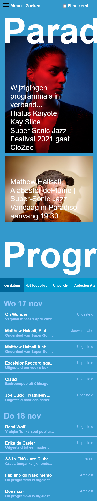
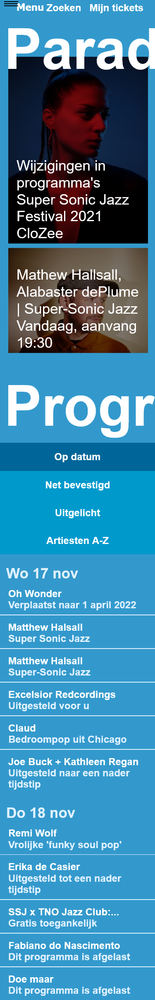

# Procesverslag
Markdown is een simpele manier om HTML te schrijven.  
Markdown cheat cheet: [Hulp bij het schrijven van Markdown](https://github.com/adam-p/markdown-here/wiki/Markdown-Cheatsheet).

Nb. De standaardstructuur en de spartaanse opmaak van de README.md zijn helemaal prima. Het gaat om de inhoud van je procesverslag. Besteedt de tijd voor pracht en praal aan je website.

Nb. Door *open* toe te voegen aan een *details* element kun je deze standaard open zetten. Fijn om dat steeds voor de relevante stuk(ken) te doen.

## Jij

uitwerken voor kick-off werkgroep

### Auteur:
Nina van Eijk

#### Je startniveau:
Blauw 

#### Je focus:
Surface plane 
 

## Je website

https://www.paradiso.nl/nl/ 

### Je opdracht:
link naar de website die je gaat namaken óf de naam/omschrijving van je eigen ontwerp

#### Screenshot(s) van de eerste pagina (small screen): 
Paradiso

#### Screenshot(s) van de tweede pagina (small screen):
hier de naam van de pagina  

 

## Breakdownschets (week 1)

uitwerken na afloop 2e werkgroep

### de hele pagina: 

### dynamisch deel (bijv menu): 

## Voortgang 1 (week 2)

uitwerken voor 1e voortgang

### Stand van zaken
Momenteel ben ik nog bezig met het opbouwen van de HTML. Ik vind het lastig om dit semantisch correct te doen, omdat Paradiso bestaat uit velen kleine stukjes tekst. 

### Verslag van meeting
Aangezien ik niet bij de meeting heb kunnen zijn ben heb ik de studentassistent bericht. Deanna en ik hebben het besproken en uiteindelijk heb ik besloten om er in mijn HTML gebruik te maken van velen List Items, Paragraven en Headings. Hierdoor is het makkelijker om elementen te selecteren, maar is het alsnog semantische correct. Daarnaast heb ik besloten om van de filters bij de agenda een NAV te maken in plaats van losse buttons, het helpt namelijk bij het navigeren en brengt je naar een ander deel van de agenda. 

## Voortgang 2 (week 3)

uitwerken voor 2e voortgang

### Stand van zaken
Momenteel werkt mijn website redelijk en is het ook om aan te zien, er moet echter nog wel gewerkt worden aan positionering en andere details. 

### Verslag van meeting
Ik heb hier tijdens de meeting vooral meegekeken en tijdens de meeting ook nog meegekregen hoe ik een laad animatie kon maken. Hier kon ik echter geen tijd meer in steken, omdat ik eerst flink moest werken aan de positionering en de CSS van mijn website. 

## Toegankelijkheidstest (week 4)

### Bevindingen
Lijst met je bevindingen die in de test naar voren kwamen:

#### Spasmes/Parkinson
Korte omschrijving: het menu is te lastig te bedienen door de kleine knoppen. Verder is het menu redelijk scrollbaar, de plaatjes zijn klikbaar, het menu zou ook breder kunnen, maar is bereikbaar. 
Oplossing: het navigatie menu moet groter: meer padding zodat het klikgedeelte makkelijker klikbaar is.  

#### Concentratieproblemen
Omschrijving: de website was redelijk behapbaar, maar in de foto’s staat teveel tekst waardoor je het niet goed kan lezen. 
Oplossing: kleinere en korte tekst op de afbeeldingen, zodat het niet een te grote lap tekst wordt. Ook eventueel grotere contrasten bij de letters, zodat je direct de aandacht hierop kan vestigen. 

#### Verschillende visuele beperkingen. 
Omschrijving: de meeste dingen gingen wel oké, alleen de agenda was vrijwel niet leesbaar. De contrasten in de agenda waren ook redelijk minimaal. 
Oplossing: de fonts en de contrasten moeten groter. 
 
#### Screenreader
Kort omschrijving: de screenreader gaat continu terug naar het hamburger menu en daardoor wordt het chaos. De puntjes achter de afbeeldingen bij de tekst zijn niet duidelijk. 
Oplossing: je zou lees meer achter alles kunnen zetten of je kan de teksten korter maken in de afbeeldingen en agenda’s. Je zou ook een speciale functie kunnen neerzetten die de tekst enkel visueel afkort. 
 
#### Tab-toets
Kort omschrijving: In principe deed de tab-toets prima zijn werk. De tab selector moet echter wel duidelijker zijn. 
Oplossing: de focus state moet meer opvallen en heeft een groter contrast nodig. 

## Voortgang 3 (week 4)

### Stand van zaken
Momenteel is mijn index pagina vrijwel klaar. Er moet enkel gewerkt worden aan een paar kleine details. Ik heb deze week ook de complete Indiestad pagina aangemaakt. Hier zijn nog enkele problemen: 
 - Er moet een slider komen die op zichzelf werkt. 
 - Mijn selectoren worden erg lang. 
 - Ik moet de agendapunten in de Paradiso pagina aan de rechterkant krijgen. 
 - Ik moet de tekst goed kunnen positioneren in de artikelen. 

### Verslag van meeting

- De slider is terug te vinden in oefening 1 van positioneren. Het is simpel op te lossen met display flex en overflow auto. 
- Sanne heeft mij aangeraden om 3 verschillende CSS pagina's aan te maken, ik hierna direct de Indiestad opmaak gescheiden van de Index opmaak. Ik heb er echter maar 2 pagina's van gemaakt omdat de Index en Indiestad pagina's nogal van elkaar verschillen. 
 - De agendapunten kunnen aan de rechterkant geplaatst worden door de elementen te verdelen in header en P
 - De tekst is makkelijk te positioneren door middel van flexbox. Ik had daarnaast een apart <time> element gemaakt voor de data, dit was goed alleen hier moesten nog data aan toegevoegd worden die die computer kan lezen. 

## Eindgesprek (week 5)

 
Verantwoording Surface plane: 

1.	Dark mode: er is een darkmode functie op de erg lichte pagina van Indiestad. 
De dark mode zou moeten werken, alleen hij werkt niet, ik heb alles meerdere keren gecheckt en hieronder staan de foto’s. Als ik werkbaar zou krijgen zou dit betekenen dat ik direct een groot stuk van mijn Surface Plane gehaald zou hebben. 
 

2.	Kerst thema; er is een kerst thema op de homepage 
Op de index pagina hoort er een prachtig kerst thema te laden, zodra je dit aangeeft bij de checkbox. Dit is helaas niet het geval aangezien de Javascript niet aansluit op mijn pagina, het probleem ligt waarschijnlijk op dezelfde plek als de darkmodus. Zodra ik dit werkend krijgt, zal er een prachtig kerstthema tevoorschijn komen. 

3.	Toegankelijkheid: door op de knop te drukken ‘Paradiso toegankelijk’, gaat de site in een modus waarbij de contrasten hoog worden, de knoppen groot en de screenreaders het nog beter doen. Ik heb hier een aparte pagina voor gemaakt, omdat de lettergrote het vaak niet goed doet bij het design en ik wilde graag het design van de website behouden. Ik vind het echter toch interessant en heb daarom gekozen om een aparte pagina hiervoor te maken. 

Bron: https://webaim.org/resources/contrastchecker/ 
Ik heb mijn contrast ratio gecheckt en ik heb daarom de contrast ratio nog hoger gemaakt voor de toegankelijke website. Ik heb de tweede font veranderd van #99ccff naar #E0F1FF. Hierdoor is het contrast groter (07.07:1) en voldoet die niet enkel aan de richtlijnen van WCAG AA zoals de normale website, maar ook aan level WCAG AAA. 

Daarnaast heb ik ook de img gefilterd voor een groter contrast met de tekst heeft, deze functie heb ik gevonden via: 
https://www.geeksforgeeks.org/how-to-darken-an-image-using-css/ 

4.	Hamburger menu
Mijn grote trots van deze website is het hamburger menu. Deze werkt interactief: de knop is veranderd van vorm en het menu rolt op een rustige en fijne manier uit. Ik heb deze gemaakt door middel van het combineren van een aantal oefeningen in de lessen. De knop heb ik zichtbaar gehouden door de Z-index te vergroten. 

5.	Selectoren
Ik heb geprobeerd om genoeg selectoren toe te voegen aan aan alle knoppen. 

6.	Animatie
Ik wilde eigenlijk nog een animatie toevoegen zodra men klikt of hovert over het kerstthema, hier ben ik echter helaas niet aan toe gekomen, aangezien ik problemen had met de darkmode.  

Stand van zaken: 
Momenteel ziet mijn website er goed uit en is die gebruiksvriendelijk. Ik heb het echter niet compleet kunnen afmaken zoals ik wilde, ik wilde graag een werkende dark mode en een werkend kerst thema. Daarnaast had ik nog graag iets met een kerst animatie willen doen. De site ziet er verder prima uit, het is semantisch correct html, er is gebruik gemaakt van costum properties en de website ziet er mooi uit. Ik heb alleen geen idee waarom de dark mode en het kerst thema niet werkt. Hierboven zijn ook codes te zien van deze dark mode. Ik merkte verder wel dat het coderen erg goed ging en leuk was in dit blok en dat je soms met een paar regeltjes code iets moois kan maken (of alles kan verpesten). Ik voel nu wel meer vrijheid tijdens het coderen, doordat ik er dit blok zo intensief mee bezig was. 

### Screenshot(s)

 Hier is de home pagina: 
 
 
 Hier is de Indiestad pagina: 
 
 
 
 
 
 Hier is de extra toegankelijke pagina: 
 

 

## Bronnenlijst

continu bijhouden terwijl je werkt

Bronnen tijdens het coderen: 
Linken naar eigen html bestand: https://www.w3schools.com/html/html_links.asp 
Hamburger menu: https://codepen.io/shooft/pen/bGoNMpP?editors=0110 
Het donker filteren van een afbeelding: https://www.geeksforgeeks.org/how-to-darken-an-image-using-css/ 
Het checken van contrast ratio: https://webaim.org/resources/contrastchecker/
Het gebruik van de Z-index: https://developer.mozilla.org/en-US/docs/Web/CSS/z-index
Het maken van een scrollbaar menu (DLO): https://codepen.io/shooft/pen/vYZKQPX 
De poging tot een dark mode (DLO): https://codepen.io/shooft/pen/ExXRLXL 
Het aangeven van de data in de agenda: https://developer.mozilla.org/en-US/docs/Web/HTML/Element/time

Paradiso Home (index.html)
CloZee, Paradiso home, article 1: 
https://www.bandsintown.com/a/2772146-clozee

Mathew Halsall, Paradiso home article 2: 
https://www.skiddle.com/artists/matthew-halsall-123507516/ 

Indiestad (indie.html)

Pond band, Indiestad, OL:first-of-type>li:first-of-type. pondBand.png: 
https://www.infinite-jest.it/pond-il-nuovo-album-della-band-si-intitola-9-ascolta-il-singolo/ 

king Hannah: OL:first-of-type> li:nth-of-type(2), kingHannahBand.jpg
https://beatsperminute.com/king-hannahs-unspoken-apprehensions-crackle-into-life-on-the-glowing-meal-deal/ 

Flyte, Indiestad, OL:first-of-type> li:nth-of-type(4), flyeBand.jpg
https://www.coggles.com/life/culture/flyte/ 

Sofie Winterson, 
https://waterpop.nl/winderig-waterpop-feest-voor-het-hele-gezin/dsc_6454-border/ 

Pip Blom, Indiestad,  
https://www.rollingstone.com/music/music-features/pip-blom-boat-interview-839541/ 

Luistertips, Indiestad, article 1, BandTipsNielsMooij.jpg. 
Memes band, ol:first-of-type>li:nth of type(3), memesBand.png
Luistertips, Indiestad, ol:nth-of-type(2)>li:nth-of-type(3), bandLuistertips.png
Social media logo’s, spotfify.png, twitter.png, insta.png, facebook.png
https://www.paradiso.nl/nl/landing/indiestad/721/indiestad/604/

